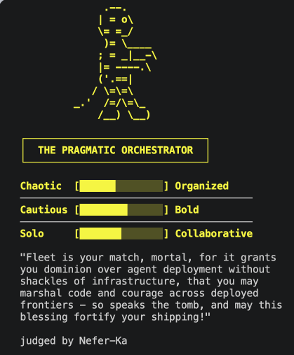

[For translation, open lesson in new tab and use Chrome translate](https://langchain-ai.github.io/lca-lessons/deepagents/m1/m1.9-practice.html)

<style>@import url('../shared/sd-components.css');</style>
<script src="../shared/sd-components.js"></script>

<div class="page-lang-switch" data-page-lang-switch>
  <button class="page-lang-btn" data-page-lang="python" aria-selected="false">Python</button>
  <button class="page-lang-btn" data-page-lang="typescript" aria-selected="false">TypeScript</button>
</div>

# Test Your Skills: Build a Judge Persona

<div style="text-align:center;margin:4rem 0 2.5rem;">
  <p style="font-size:0.8rem;color:#40668D;font-family:'IBM Plex Mono',monospace;letter-spacing:0.07em;text-transform:uppercase;margin-bottom:0.75rem;">&#8595; click to celebrate &#8595;</p>
  <button id="get-started-btn" onclick="launchConfetti()" style="
    background: #fff;
    color: #000;
    border: 2px solid #000;
    border-radius: 12px;
    padding: 18px 48px;
    font-size: 1.3rem;
    font-weight: 700;
    font-family: 'IBM Plex Mono', monospace;
    cursor: pointer;
    letter-spacing: 0.04em;
    white-space: nowrap;
    box-sizing: border-box;
    box-shadow: 0 4px 18px rgba(0,0,0,0.15);
    transition: transform 0.15s, box-shadow 0.15s;
  "
  onmouseover="this.style.transform='scale(1.07)';this.style.boxShadow='0 6px 28px rgba(0,0,0,0.3)'"
  onmouseout="this.style.transform='scale(1)';this.style.boxShadow='0 4px 18px rgba(0,0,0,0.15)'"
  > Congratulations on finishing Module 1!</button>
</div>

<canvas id="confetti-canvas" style="position:fixed;top:0;left:0;width:100%;height:100%;pointer-events:none;z-index:9999;display:none;"></canvas>

<p style="font-size:0.8rem;color:#40668D;font-family:'IBM Plex Mono',monospace;letter-spacing:0.07em;text-transform:uppercase;margin:0 0 0.75rem;">You've now covered</p>

<div style="display:grid;grid-template-columns:repeat(2,1fr);gap:10px;margin-bottom:1.75rem;">
  <div style="display:flex;align-items:center;gap:10px;background:#F2FAFF;border:1px solid #CCE9FF;border-radius:10px;padding:10px 14px;font-size:0.92rem;color:#030710;"><span style="color:#006DDD;font-weight:700;">✓</span>Running a deep agent</div>
  <div style="display:flex;align-items:center;gap:10px;background:#F2FAFF;border:1px solid #CCE9FF;border-radius:10px;padding:10px 14px;font-size:0.92rem;color:#030710;"><span style="color:#006DDD;font-weight:700;">✓</span>Choosing models</div>
  <div style="display:flex;align-items:center;gap:10px;background:#F2FAFF;border:1px solid #CCE9FF;border-radius:10px;padding:10px 14px;font-size:0.92rem;color:#030710;"><span style="color:#006DDD;font-weight:700;">✓</span>Writing system prompts</div>
  <div style="display:flex;align-items:center;gap:10px;background:#F2FAFF;border:1px solid #CCE9FF;border-radius:10px;padding:10px 14px;font-size:0.92rem;color:#030710;"><span style="color:#006DDD;font-weight:700;">✓</span>Optimizing with prompt caching</div>
  <div style="display:flex;align-items:center;gap:10px;background:#F2FAFF;border:1px solid #CCE9FF;border-radius:10px;padding:10px 14px;font-size:0.92rem;color:#030710;"><span style="color:#006DDD;font-weight:700;">✓</span>Building custom tools</div>
  <div style="display:flex;align-items:center;gap:10px;background:#F2FAFF;border:1px solid #CCE9FF;border-radius:10px;padding:10px 14px;font-size:0.92rem;color:#030710;"><span style="color:#006DDD;font-weight:700;">✓</span>Connecting MCP servers</div>
  <div style="display:flex;align-items:center;gap:10px;background:#F2FAFF;border:1px solid #CCE9FF;border-radius:10px;padding:10px 14px;font-size:0.92rem;color:#030710;"><span style="color:#006DDD;font-weight:700;">✓</span>Messages, threads, checkpointers</div>
  <div style="display:flex;align-items:center;gap:10px;background:#F2FAFF;border:1px solid #CCE9FF;border-radius:10px;padding:10px 14px;font-size:0.92rem;color:#030710;"><span style="color:#006DDD;font-weight:700;">✓</span>Human-in-the-loop approval</div>
</div>

<div style="text-align:center;font-size:1.5rem;color:#34D399;margin:0.25rem 0 1rem;">↓</div>

<div style="background:#E3F9F0;border:1.5px solid #34D399;border-radius:12px;padding:1rem 1.25rem;color:#0B4A34;">
  <p style="margin:0 0 0.5rem;font-weight:700;font-size:1rem;color:#0B4A34;">Fun Personality Quiz!</p>
  <p style="margin:0;">In this practice, everything you just learned comes together into a fun personality quiz that figures out what kind of developer/builder you are, then matches you to a real LangChain product based on that style.</p>
  <p style="margin:0.5rem 0 0;">How it works: each answer scores you on a few traits. Your highest-scoring traits pick your matched product from <code>PRODUCT_MATCHES</code>. You don't design this part, you just wire TODO 2 into it.</p>
</div>

<script>
(function () {
  var canvas, ctx, particles = [], running = false, animId;

  var COLORS = [
    '#006DDD','#3399FF','#7FC8FF','#CCE9FF',
    '#0E9F6E','#34D399','#99F6E4',
    '#FFE9A8','#FF8FA3','#ffffff'
  ];

  function Confetti(x, y) {
    this.x = x; this.y = y;
    this.vx = (Math.random() - 0.5) * 7;
    this.vy = -(9 + Math.random() * 10);
    this.gravity = 0.32 + Math.random() * 0.16;
    this.rotation = Math.random() * Math.PI * 2;
    this.rotationSpeed = (Math.random() - 0.5) * 0.3;
    this.width = 5 + Math.random() * 5;
    this.height = 3 + Math.random() * 4;
    this.color = COLORS[Math.floor(Math.random() * COLORS.length)];
    this.life = 0;
    this.maxLife = 90 + Math.floor(Math.random() * 45);
  }

  Confetti.prototype.update = function () {
    this.vy += this.gravity;
    this.x += this.vx;
    this.y += this.vy;
    this.rotation += this.rotationSpeed;
    this.life++;
  };

  Confetti.prototype.alpha = function () {
    var fadeStart = this.maxLife * 0.7;
    if (this.life < fadeStart) return 1;
    return Math.max(0, 1 - (this.life - fadeStart) / (this.maxLife - fadeStart));
  };

  Confetti.prototype.dead = function () {
    return this.life >= this.maxLife || this.y > (canvas ? canvas.height + 40 : 1e9);
  };

  Confetti.prototype.draw = function (ctx) {
    var a = this.alpha();
    if (a <= 0) return;
    ctx.save();
    ctx.globalAlpha = a;
    ctx.translate(this.x, this.y);
    ctx.rotate(this.rotation);
    ctx.fillStyle = this.color;
    ctx.fillRect(-this.width / 2, -this.height / 2, this.width, this.height);
    ctx.restore();
  };

  function spawnConfetti() {
    var x = Math.random() * window.innerWidth;
    var y = window.innerHeight + 10;
    particles.push(new Confetti(x, y));
  }

  function loop() {
    ctx.clearRect(0, 0, canvas.width, canvas.height);
    particles = particles.filter(function (p) { return !p.dead(); });
    particles.forEach(function (p) { p.update(); p.draw(ctx); });
    if (running || particles.length > 0) animId = requestAnimationFrame(loop);
    else { canvas.style.display = 'none'; }
  }

  window.launchConfetti = function () {
    if (!canvas) {
      canvas = document.getElementById('confetti-canvas');
      ctx = canvas.getContext('2d');
    }
    canvas.width = window.innerWidth;
    canvas.height = window.innerHeight;
    canvas.style.display = 'block';

    var btn = document.getElementById('get-started-btn');
    if (!btn.style.width) btn.style.width = btn.offsetWidth + 'px';
    btn.textContent = 'Again!';

    particles = [];
    running = true;

    var shots = 0, maxShots = 16;
    function fire() {
      if (shots >= maxShots) { running = false; return; }
      var count = 10 + Math.floor(Math.random() * 10);
      for (var i = 0; i < count; i++) spawnConfetti();
      shots++;
      setTimeout(fire, 90 + Math.random() * 180);
    }

    if (animId) cancelAnimationFrame(animId);
    fire();
    loop();
  };
})();
</script>

---

<div style="border:2px solid #D32F2F;border-radius:6px;background:#FDECEA;padding:12px 16px;margin:1rem 0;" markdown="1">

**This practice was restructured slightly for clarity on September 28, 2026.** The TODOs are now numbered in the order you work through them, and the MCP stretch goal (now TODO 6) no longer has to be finished before the script runs. Pull the latest changes from the repo root to get the new version:

```bash
git pull
```

<div data-lang="python" markdown="1">

If you've already edited `judge_card_practice.py`, copy your persona and any code you wrote somewhere safe first, since the pull may conflict with your edits.

</div>

<div data-lang="typescript" markdown="1">

If you've already edited `judge_card_practice.ts`, copy your persona and any code you wrote somewhere safe first, since the pull may conflict with your edits.

</div>

</div>

<style>
.tdr-head {
  display: flex;
  background: #0B1220;
  color: #F2FAFF;
  font: 600 13px 'IBM Plex Mono', monospace;
  padding: 10px 16px 10px 44px;
  border: 1.5px solid #21324A;
  border-bottom: none;
  border-radius: 8px 8px 0 0;
}
.tdr-row {
  border: 1.5px solid #21324A;
  border-top: none;
  border-radius: 0;
  background: #fff;
  margin: 0;
}
.tdr-row:last-of-type { border-radius: 0 0 8px 8px; }
.tdr-row summary {
  display: flex;
  align-items: center;
  position: relative;
  padding: 12px 16px 12px 44px;
  cursor: pointer;
  list-style: none;
  font-size: 14px;
  color: #1c1c1c;
  font-weight: 400;
}
.tdr-row summary::-webkit-details-marker { display: none; }
.tdr-row summary::before {
  content: '\25B8';
  position: absolute;
  left: 16px;
  top: 50%;
  font-size: 22px;
  line-height: 1;
  color: #40668D;
  transition: transform .15s ease;
  transform: translateY(-50%);
}
.tdr-row[open] summary::before { transform: translateY(-50%) rotate(90deg); }
.tdr-row summary:hover { background: #F2FAFF; }
.tdr-row > *:not(summary) { margin-left: 34px; margin-right: 34px; }
.tdr-row > summary + * { margin-top: 14px; }
.tdr-col-1 { flex: 0 0 10%; font-weight: 600; padding-right: 12px; }
.tdr-col-2 { flex: 0 0 26%; padding-right: 12px; }
.tdr-col-3 { flex: 1; padding-right: 32px; }
.tdr-col-4 { flex: 0 0 13%; }
.tdr-row .tdr-col-4 { color: #40668D; }
@media (max-width: 700px) {
  .tdr-head { display: none; }
  .tdr-row summary { flex-wrap: wrap; gap: 4px; }
  .tdr-col-1, .tdr-col-2, .tdr-col-3, .tdr-col-4 { flex: 0 0 100%; padding-right: 0; }
  .tdr-row > *:not(summary) { margin-left: 16px; margin-right: 16px; }
}
</style>

<div data-lang="python" markdown="1">

## What you'll build

Open `python/m1/Practice/judge_card_practice.py`. Once it's finished, one run:

1. Asks you the 8-question quiz in your terminal.
2. Hands your answers to an agent running your judge persona.
3. The agent scores your traits, matches you to a real LangChain product, and renders your result card as ASCII art in your terminal (also saved to `output/`).
4. The agent drafts a post announcing your result. Once you've done TODO 4, it pauses so you can approve, edit, or reject the post before it goes out. The post is a mock, nothing actually leaves your terminal, so screenshot your real card and post it on X or LinkedIn with @LangChain tagged, we would love to see what you build!

## What's provided

The mechanical parts live in `judge_card_helpers.py`, same idea as `models.py`: shared setup you import, not code you need to read to do this practice exercise.

- `run_quiz()`: the 8-question arrow-key quiz.
- `PRODUCT_MATCHES`: the trait -> real LangChain product lookup.
- `render_card()`: renders and saves your finished card as ASCII art.
- `post_card()`: the "publish" tool. Renders a mock post on our fake X platform; nothing ever leaves your terminal.
- `run_judge()`: the invoke/interrupt-resume loop. You already wrote this once in the HITL lesson, no need to write it again.
- `TOOL_SEQUENCE`: the tool-calling steps every persona shares.

We've provided the quiz and scoring code above so you can focus on the lesson content, not boilerplate.

## What you fill in

6 TODOs: small direct changes tied to a Module 1 lesson, numbered in the order they appear in the file.

[Dropdown Table]: Click a row to see step-by-step instructions for that TODO.

<div class="tdr-head">
  <div class="tdr-col-1">TODO</div>
  <div class="tdr-col-2">Lesson</div>
  <div class="tdr-col-3">What you do</div>
  <div class="tdr-col-4">Required?</div>
</div>

<details class="tdr-row" markdown="1">
<summary><span class="tdr-col-1">1</span><span class="tdr-col-2">The System Prompt: Persona</span><span class="tdr-col-3">Write your own judge persona, a name and a voice. This is the card that gets posted.</span><span class="tdr-col-4">Yes</span></summary>

- **Where:** the `"your_persona"` entry in `JUDGE_PERSONAS`, below the three example judges.
- **What to do:** replace the placeholder text with your judge's personality, starting with "You are &lt;Name&gt;, ...". The three example judges show what this looks like.
- **What to skip:** don't describe the steps (scoring, matching, posting). `TOOL_SEQUENCE` already adds those to every persona for you.

</details>

<details class="tdr-row" markdown="1">
<summary><span class="tdr-col-1">2</span><span class="tdr-col-2">Tools: Custom Tools</span><span class="tdr-col-3">Finish <code>score_and_match()</code>: turn the tallied trait scores into a matched product.</span><span class="tdr-col-4">Yes</span></summary>

- **Where:** the `# TODO here` comment inside `score_and_match()`.
- **What to do:** follow the four numbered comments to pick the matched product and return it. The score tallying above it is already written.
- **Until it's done:** the script stops with `Stopped: TODO 2`. That's expected, not a crash.
- **Run it:** take the quiz. You should see one card signed by your judge, then a "posted" banner.

</details>

<details class="tdr-row" markdown="1">
<summary><span class="tdr-col-1">3</span><span class="tdr-col-2">Messages, Threads, and Checkpointers</span><span class="tdr-col-3">Add an example judge to <code>JUDGES_TO_RUN</code> so it runs in its own thread; compare both cards.</span><span class="tdr-col-4">Yes</span></summary>

- **Where:** `JUDGES_TO_RUN`.
- **What to do:** add one example judge's key, for example `"ancient_mummy"`. You don't need to write another persona.
- **Run it:** you should get one card per judge, each from its own thread, judging the same quiz answers.

</details>

<details class="tdr-row" markdown="1">
<summary><span class="tdr-col-1">4</span><span class="tdr-col-2">Human-in-the-Loop: Decision Types</span><span class="tdr-col-3">Set <code>INTERRUPT_ON</code> so posting the card requires your approval first.</span><span class="tdr-col-4">Yes</span></summary>

- **Where:** `INTERRUPT_ON`.
- **What to do:** set it so `post_card` needs your approval. The comment next to it shows the shape.
- **Run it:** before each post, you should see a draft and an `approve/edit/reject` prompt. Try `edit` to rewrite a caption.

</details>

<details class="tdr-row" markdown="1">
<summary><span class="tdr-col-1">5</span><span class="tdr-col-2">Models</span><span class="tdr-col-3">Set <code>MODEL</code> to <code>strong_model</code> and compare comedic timing.</span><span class="tdr-col-4">Optional</span></summary>

- **Where:** `MODEL`.
- **What to do:** add `strong_model` to the `from models import model` line at the top of the file, then set `MODEL = strong_model`.
- **Run it:** compare the comedic timing with the default model.

</details>

<details class="tdr-row" markdown="1">
<summary><span class="tdr-col-1">6</span><span class="tdr-col-2">MCP</span><span class="tdr-col-3">Replace the placeholder product fact with a real one from the LangChain docs MCP server.</span><span class="tdr-col-4">Stretch goal</span></summary>

- **Where:** `fetch_product_fact`, near the bottom of the file.
- **What to do:** follow the comment block above it to look up one fact from the LangChain docs MCP server, the same way `m1.6_agent_mcp.py` does.
- **Until it's done:** the tool returns `PLACEHOLDER_FACT`, so verdicts are based on your trait scores only.
- **If the lookup fails:** print the error, then return `PLACEHOLDER_FACT`. The agent gets the same placeholder text whether TODO 6 is unfinished or the docs server is unreachable, so the printed error is how you tell the two apart.

</details>

## Run it

```bash
cd python
uv run python m1/Practice/judge_card_practice.py
```

Stuck, or want to see the finished shape before you start? `judge_card_practice_filled.py` is a reference copy with TODOs 1 to 4 and the TODO 6 stretch goal filled in; run it the same way to see what "done" looks like end to end.

Try to avoid peeking unless you're really stuck, you'll get more out of this by working through the TODOs yourself first.

</div>

<div data-lang="typescript" markdown="1">

## What you'll build

Open `typescript/m1/Practice/judge_card_practice.ts`. Once it's finished, one run:

1. Asks you the 8-question quiz in your terminal.
2. Hands your answers to an agent running your judge persona.
3. The agent scores your traits, matches you to a real LangChain product, and renders your result card as ASCII art in your terminal (also saved to `output/`).
4. The agent drafts a post announcing your result. Once you've done TODO 4, it pauses so you can approve, edit, or reject the post before it goes out. The post is a mock, nothing actually leaves your terminal, so screenshot your real card and post it on X or LinkedIn with @LangChain tagged, we would love to see what you build!

## What's provided

The mechanical parts live in `judge_card_helpers.ts`, same idea as `models.ts`: shared setup you import, not code you need to read to do this practice exercise.

- `runQuiz()`: the 8-question arrow-key quiz.
- `PRODUCT_MATCHES`: the trait -> real LangChain product lookup.
- `renderCard`: renders and saves your finished card as ASCII art.
- `postCard`: the "publish" tool. Renders a mock post on our fake X platform; nothing ever leaves your terminal.
- `runJudge()`: the invoke/interrupt-resume loop. You already wrote this once in the HITL lesson, no need to write it again.
- `TOOL_SEQUENCE`: the tool-calling steps every persona shares.

We've provided the quiz and scoring code above so you can focus on the lesson content, not boilerplate.

## What you fill in

6 TODOs: small direct changes tied to a Module 1 lesson, numbered in the order they appear in the file.

[Dropdown Table]: Click a row to see step-by-step instructions for that TODO.

<div class="tdr-head">
  <div class="tdr-col-1">TODO</div>
  <div class="tdr-col-2">Lesson</div>
  <div class="tdr-col-3">What you do</div>
  <div class="tdr-col-4">Required?</div>
</div>

<details class="tdr-row" markdown="1">
<summary><span class="tdr-col-1">1</span><span class="tdr-col-2">The System Prompt: Persona</span><span class="tdr-col-3">Write your own judge persona, a name and a voice. This is the card that gets posted.</span><span class="tdr-col-4">Yes</span></summary>

- **Where:** the `"your_persona"` entry in `JUDGE_PERSONAS`, below the three example judges.
- **What to do:** replace the placeholder text with your judge's personality, starting with "You are &lt;Name&gt;, ...". The three example judges show what this looks like.
- **What to skip:** don't describe the steps (scoring, matching, posting). `TOOL_SEQUENCE` already adds those to every persona for you.

</details>

<details class="tdr-row" markdown="1">
<summary><span class="tdr-col-1">2</span><span class="tdr-col-2">Tools: Custom Tools</span><span class="tdr-col-3">Finish <code>scoreAndMatch</code>: turn the tallied trait scores into a matched product.</span><span class="tdr-col-4">Yes</span></summary>

- **Where:** the `// TODO here` comment inside `scoreAndMatch`.
- **What to do:** follow the four numbered comments to pick the matched product and return it. The score tallying above it is already written.
- **Until it's done:** the script stops with `Stopped: TODO 2`. That's expected, not a crash.
- **Run it:** take the quiz. You should see one card signed by your judge, then a "posted" banner.

</details>

<details class="tdr-row" markdown="1">
<summary><span class="tdr-col-1">3</span><span class="tdr-col-2">Messages, Threads, and Checkpointers</span><span class="tdr-col-3">Add an example judge to <code>JUDGES_TO_RUN</code> so it runs in its own thread; compare both cards.</span><span class="tdr-col-4">Yes</span></summary>

- **Where:** `JUDGES_TO_RUN`.
- **What to do:** add one example judge's key, for example `"ancient_mummy"`. You don't need to write another persona.
- **Run it:** you should get one card per judge, each from its own thread, judging the same quiz answers.

</details>

<details class="tdr-row" markdown="1">
<summary><span class="tdr-col-1">4</span><span class="tdr-col-2">Human-in-the-Loop: Decision Types</span><span class="tdr-col-3">Set <code>INTERRUPT_ON</code> so posting the card requires your approval first.</span><span class="tdr-col-4">Yes</span></summary>

- **Where:** `INTERRUPT_ON`.
- **What to do:** set it so `post_card` needs your approval. The comment next to it shows the shape.
- **Run it:** before each post, you should see a draft and an `approve/edit/reject` prompt. Try `edit` to rewrite a caption.

</details>

<details class="tdr-row" markdown="1">
<summary><span class="tdr-col-1">5</span><span class="tdr-col-2">Models</span><span class="tdr-col-3">Set <code>MODEL</code> to <code>strongModel</code> and compare comedic timing.</span><span class="tdr-col-4">Optional</span></summary>

- **Where:** `MODEL`.
- **What to do:** add `strongModel` to the `import { model } from "../../models.js"` line at the top of the file, then set `const MODEL = strongModel`.
- **Run it:** compare the comedic timing with the default model.

</details>

<details class="tdr-row" markdown="1">
<summary><span class="tdr-col-1">6</span><span class="tdr-col-2">MCP</span><span class="tdr-col-3">Replace the placeholder product fact with a real one from the LangChain docs MCP server.</span><span class="tdr-col-4">Stretch goal</span></summary>

- **Where:** `fetchProductFact`, near the bottom of the file.
- **What to do:** follow the comment block above it to look up one fact from the LangChain docs MCP server, the same way `m1.6_agent_mcp.ts` does.
- **Until it's done:** the tool returns `PLACEHOLDER_FACT`, so verdicts are based on your trait scores only.
- **If the lookup fails:** log the error, then return `PLACEHOLDER_FACT`. The agent gets the same placeholder text whether TODO 6 is unfinished or the docs server is unreachable, so the logged error is how you tell the two apart.

</details>

## Run it

```bash
cd typescript
pnpm tsx ./m1/Practice/judge_card_practice.ts
```

Stuck, or want to see the finished shape before you start? `judge_card_practice_filled.ts` is a reference copy with TODOs 1 to 4 and the TODO 6 stretch goal filled in; run it the same way to see what "done" looks like end to end.

Try to avoid peeking unless you're really stuck, you'll get more out of this by working through the TODOs yourself first.

</div>

<details style="width:50%;background:#fff;border:1.5px solid #000;">
<summary style="color:#000;border-bottom:none;">Sneak Peek [click to expand]</summary>



</details>

## Share it

<div style="background:#CCE9FF;border:1.5px solid #7FC8FF;border-radius:12px;padding:1rem 1.25rem;color:#030710;">Got a card you like? Screenshot it, tag @LangChain on X or LinkedIn, and show us what your judge came up with. We want to see what you build!</div>

